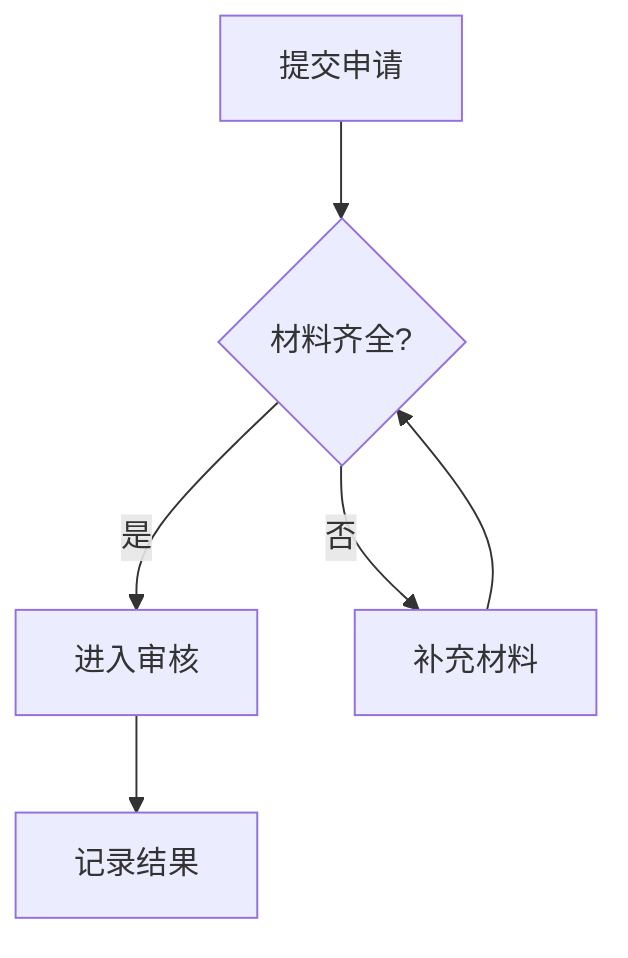

## 选择创建方式

自然语言适合先生成草稿，Mermaid 适合明确规定节点和连线，手动绘制适合微调布局。描述流程时写清起点、操作、判断与结束状态，例如“提交订单后校验库存；有货进入支付，无货返回修改”。

## 使用 Mermaid

在工具箱中选择 Mermaid 转流程图，输入代码并转换。下面的例子包含两个判断出口：

检查箭头方向和判断标签，再按实际业务修改。这里展示的是可供工具转换的代码，不会在文档内自动执行。

## 手动绘制流程

1. 从形状工具建立节点：矩形表示操作，菱形表示判断，椭圆或圆角矩形表示起止，平行四边形表示输入输出。
2. 双击节点填写说明，保持短句和一致的命名方式。
3. 按 `A` 使用箭头，从起始节点拖到目标节点；需要拐弯时选择折线箭头。
4. 双击连线写“是”“否”等分支标签。拖动端点可改变连接位置。
5. 调整节点布局，确认连线仍然附着在节点上。

## 整理布局与验收

多选节点后使用左右、上下或居中对齐，再等距分布。重复结构可整体复制；把大流程拆为子流程往往更便于阅读。

| 快捷操作 | 按键 |
| --- | --- |
| 矩形 / 椭圆 / 箭头 | `R` / `O` / `A` |
| 回到选择工具 | `V` |
| 编辑节点文字 | 双击 |
| 删除对象 | `Delete` |

从入口沿每条分支走到出口，检查遗漏路径、死循环和无标签的判断。最后导出 PNG，查看文字和箭头是否清晰。
